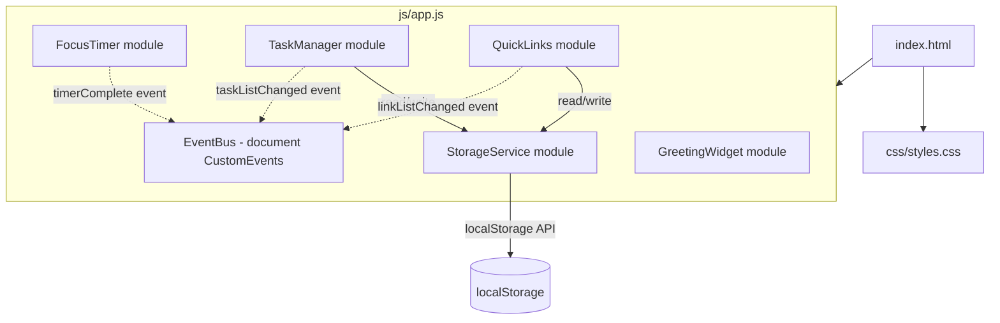
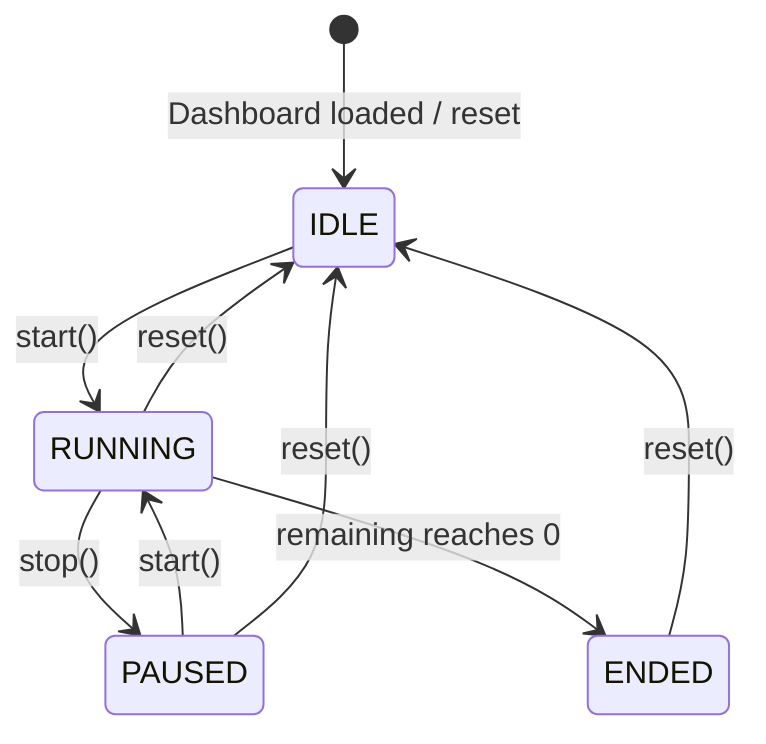

# Design Document — Todo List Life Dashboard

## Overview

The Todo List Life Dashboard is a single-page, client-side web application built entirely with plain HTML, CSS, and Vanilla JavaScript. No build tools, frameworks, or external dependencies are used. The app runs directly from the file system (or as a browser extension) and persists all state in the browser's `localStorage`.

The four primary UI modules are:

| Widget | Purpose |
|---|---|
| Greeting_Widget | Live clock, date, and time-of-day greeting |
| Focus_Timer | 25-minute Pomodoro countdown |
| Task_Manager | CRUD task list |
| Quick_Links_Panel | User-defined URL shortcut buttons |

All modules share a single JavaScript file (`js/app.js`) and a single CSS file (`css/styles.css`), as required by the technical constraints.

---

## Architecture

The application follows a **Module Pattern** — each widget is an immediately-invoked or explicitly-initialized JavaScript module object. All modules live inside the single `js/app.js` file and communicate through a shared, minimal event bus (plain `CustomEvent` on `document`).



### Key Architecture Decisions

- **No framework**: Keeps the dependency surface at zero and satisfies Requirement 10.1.
- **Module objects** instead of ES modules: Avoids `type="module"` restrictions when opening from `file://` without a local server, which is a common deployment scenario for browser extensions and standalone pages.
- **Single JS / Single CSS**: Satisfies Requirements 10.2 and 10.3. All widget code and styles are co-located in their respective single files, organized by comments/sections.
- **StorageService abstraction**: Centralises all `localStorage` access so that error handling (unavailable storage, corrupted JSON) is handled in one place rather than scattered across modules.

---

## Components and Interfaces

### GreetingWidget

Responsible for updating the time, date, and greeting message.

```
GreetingWidget
  init()                   → void   // binds DOM, starts clock tick
  _tick()                  → void   // called every second by setInterval
  _getGreeting(hour: int)  → string // returns greeting text for hour 0-23
  _formatTime(date: Date)  → string // "HH:MM"
  _formatDate(date: Date)  → string // "DayOfWeek, D Month YYYY"
```

**Clock strategy**: `setInterval` fires every **500 ms** (not 1000 ms) to avoid missing a minute boundary due to timer drift. `_tick` checks whether the displayed minute has changed before touching the DOM.

### FocusTimer

Manages countdown state machine.

```
FocusTimer
  init()         → void   // binds DOM, sets initial display
  start()        → void   // start countdown if IDLE or PAUSED
  stop()         → void   // pause countdown if RUNNING
  reset()        → void   // stop + reset to 25:00
  _tick()        → void   // called every 1000 ms by setInterval
  _setDisplay(remaining: int) → void  // updates DOM, or "Session Complete"
```

**Timer states**:



State transitions satisfy Requirements 2.4, 2.5, 2.7, 2.8, and 2.9.

### TaskManager

Handles all task CRUD operations.

```
TaskManager
  init()                            → void
  _render()                         → void   // re-renders full task list from state
  _addTask(description: string)     → void
  _editTask(id: string, description: string) → void
  _toggleComplete(id: string)       → void
  _deleteTask(id: string)           → void
  _persistTasks()                   → void   // writes to StorageService
  _loadTasks()                      → Task[] // reads from StorageService
  _validateDescription(text: string): { valid: boolean, error?: string }
```

Each task row is rendered from a `<template>` element cloned per task, avoiding string HTML injection (XSS safety).

### QuickLinks

Handles link CRUD and opening.

```
QuickLinks
  init()                                → void
  _render()                             → void
  _addLink(label: string, url: string)  → void
  _deleteLink(id: string)               → void
  _openLink(url: string)                → void  // window.open(url, '_blank', 'noopener,noreferrer')
  _persistLinks()                       → void
  _loadLinks()                          → Link[]
  _validateLink(label: string, url: string): { valid: boolean, errors: string[] }
```

### StorageService

Central module for all `localStorage` access with error isolation.

```
StorageService
  isAvailable()                   → boolean
  get(key: string)                → any | null   // parse JSON; null on failure
  set(key: string, value: any)    → boolean      // stringify; returns false on failure
  remove(key: string)             → void
```

Handles: unavailable storage (Req 6.5), invalid JSON (Req 6.3, 9.2), missing fields on entries (Req 6.4, 9.3).

---

## Data Models

### Task

```js
{
  id:        string,   // crypto.randomUUID() or Date.now().toString()
  text:      string,   // 1–500 characters, trimmed
  completed: boolean   // true = done, false = pending
}
```

Persisted under `localStorage` key `"tasks"` as a JSON array.

### Link

```js
{
  id:    string,  // crypto.randomUUID() or Date.now().toString()
  label: string,  // 1–100 characters, trimmed
  url:   string   // starts with http:// or https://, contains dot in host, max 2048 chars
}
```

Persisted under `localStorage` key `"links"` as a JSON array.

### localStorage Schema

```
localStorage
  "tasks"  → JSON string of Task[]
  "links"  → JSON string of Link[]
```

No other keys are written. Both keys are absent until the user creates at least one item.

---

## Correctness Properties

*A property is a characteristic or behavior that should hold true across all valid executions of a system — essentially, a formal statement about what the system should do. Properties serve as the bridge between human-readable specifications and machine-verifiable correctness guarantees.*

### Property 1: Greeting message is determined solely by hour

*For any* device time, the greeting message returned by `_getGreeting(hour)` shall be exactly one of {"Good Morning", "Good Afternoon", "Good Evening", "Good Night"}, and each hour value 0–23 shall map to exactly one greeting, consistent with the hour-range rules in Requirements 1.3–1.6.

**Validates: Requirements 1.3, 1.4, 1.5, 1.6**

---

### Property 2: Time format is always HH:MM

*For any* `Date` object, `_formatTime(date)` shall return a string matching the regular expression `^\d{2}:\d{2}$`, with hours in [00, 23] and minutes in [00, 59].

**Validates: Requirements 1.1**

---

### Property 3: Date format matches "DayOfWeek, D Month YYYY"

*For any* `Date` object, `_formatDate(date)` shall return a string matching the pattern `<Weekday>, <D> <MonthName> <4-digit Year>` (e.g., "Monday, 2 June 2025").

**Validates: Requirements 1.2**

---

### Property 4: Adding a valid task grows the task list by exactly one

*For any* task list of length N and any non-whitespace-only description of 1–500 characters, calling `_addTask` shall result in a task list of length N+1 where the last entry has the submitted text (trimmed) and `completed: false`.

**Validates: Requirements 3.2, 3.4**

---

### Property 5: Whitespace-only and empty descriptions are always rejected

*For any* string composed entirely of whitespace characters (including the empty string), calling `_addTask` or `_editTask` with that string shall not modify the task list and shall return/signal a validation error.

**Validates: Requirements 3.3, 4.5**

---

### Property 6: Task toggle is an involution (round-trip)

*For any* task, toggling its `completed` state twice (complete then uncomplete, or uncomplete then complete) shall restore the task to its original `completed` value.

**Validates: Requirements 5.2, 5.3**

---

### Property 7: Task persistence round-trip

*For any* array of valid Task objects, serializing to `localStorage` via `_persistTasks()` and then deserializing via `_loadTasks()` shall return an array of tasks with identical `id`, `text`, and `completed` fields.

**Validates: Requirements 6.1, 6.2**

---

### Property 8: Link validation accepts only well-formed URLs

*For any* (label, url) pair, `_validateLink` shall accept the pair if and only if the label is non-empty and ≤100 characters, the URL starts with `http://` or `https://`, the URL's host portion contains at least one dot, and the URL is ≤2048 characters.

**Validates: Requirements 7.2, 7.3**

---

### Property 9: Link persistence round-trip

*For any* array of valid Link objects, serializing to `localStorage` via `_persistLinks()` and then deserializing via `_loadLinks()` shall return an array of links with identical `id`, `label`, and `url` fields.

**Validates: Requirements 9.1**

---

### Property 10: Corrupted localStorage yields an empty list, not an error

*For any* string value stored under the `"tasks"` or `"links"` key that is not valid JSON or does not parse as an array, `_loadTasks()` / `_loadLinks()` shall return an empty array without throwing, and shall clear the corrupted key from `localStorage`.

**Validates: Requirements 6.3, 9.2**

---

### Property 11: Description edit preserves all other task fields

*For any* task, updating its `text` field via `_editTask` shall leave the `id` and `completed` fields unchanged.

**Validates: Requirements 4.3, 4.4**

---

### Property 12: Deleting an item removes it from the list

*For any* non-empty list of tasks (or links) and any item in that list, calling `_deleteTask(id)` (or `_deleteLink(id)`) shall produce a list that does not contain an item with that `id`, and whose length is exactly one less than before.

**Validates: Requirements 5.5, 8.3**

---

## Error Handling

| Scenario | Module | Behaviour |
|---|---|---|
| `localStorage` unavailable on load | StorageService | `isAvailable()` returns `false`; TaskManager and QuickLinks render empty lists and display a non-blocking banner (Req 6.5) |
| `localStorage` write failure | StorageService | `set()` returns `false`; calling module displays an error message; in-memory state is preserved (Req 3.5) |
| Corrupted JSON under `"tasks"` key | TaskManager | Clears key, renders empty list, no error shown to user (Req 6.3) |
| Corrupted JSON under `"links"` key | QuickLinks | Clears key, renders empty panel, no error shown to user (Req 9.2) |
| Task entry missing `text` or `completed` | TaskManager | Entry silently skipped during load (Req 6.4) |
| Link entry missing `label` or `url` | QuickLinks | Entry silently skipped during load (Req 9.3) |
| Empty / whitespace task description | TaskManager | Inline error near input field, input stays focused (Req 3.3) |
| Invalid link label or URL | QuickLinks | Inline error per field, focus moved to first invalid field (Req 7.3) |
| Edit confirmed with empty description | TaskManager | Edit rejected, original description retained (Req 4.5) |
| Start pressed when timer already running | FocusTimer | No action taken (Req 2.8) |
| Start pressed when session ended | FocusTimer | No action taken; user must reset first (Req 2.9) |
| Stop pressed when timer not running | FocusTimer | No action taken (Req 2.5) |

---

